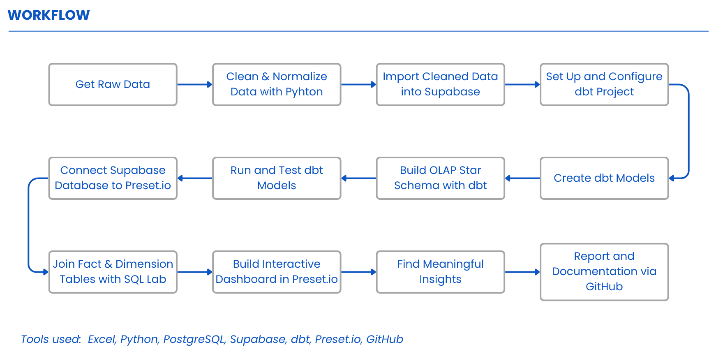
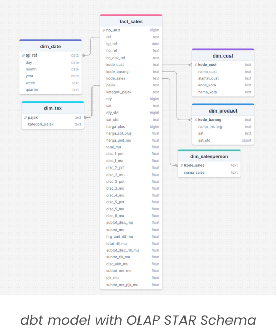
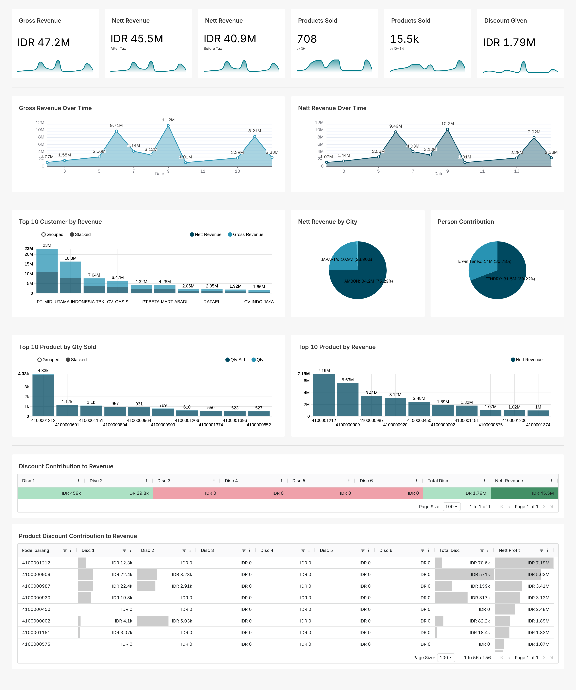

# 📊 SALES ANALYTICS DASHBOARD  
##Strategic Insights from Sales Performance and Discount Contribution

---

## 📌 PROJECT OVERVIEW  
This project explores a comprehensive sales dataset to uncover key performance drivers through data cleaning, modeling, and visualization. Using a modern data stack, including Supabase, dbt, and Superset (via Preset.io), I built an OLAP-based data model and interactive dashboard to monitor product performance, revenue trends, and discount impact.  
The goal is to empower stakeholders with actionable insights to optimize sales strategy, evaluate promotion effectiveness, and enhance revenue consistency.

### 📁 Documentation:
- 🔗 [GitHub Repository](#)  
- 🔗 [Supabase Database](#)  
- 🔗 [Superset Dashboard (via Preset.io)](#)  
- 🔗 [Presentation Deck](#)

---

## 🔁 WORKFLOW  

---

## 🧱 DATABASE SCHEMA  
  

This database was designed using the OLAP Star Schema approach, with a central fact table `fact_sales` that records key sales metrics, surrounded by six dimension tables that provide descriptive context:
- `dim_cust`: customer information  
- `dim_date`: date and time details  
- `dim_product`: product details  
- `dim_salesperson`: sales person information  
- `dim_tax`: tax information  

Using dbt, all data transformations are modular, documented, and version controlled, ensuring a clean, consistent, and analysis-ready data pipeline. This structure enables efficient querying and seamless integration with BI tools.

---

## ❓ PROBLEM STATEMENT & OBJECTIVES

### 🧩 Problem Statement  
The business currently holds raw sales data that lacks structure and analytical readiness. In its current form, the data cannot support effective reporting or decision-making processes. To drive actionable insights, the data needs to be cleaned, transformed, and organized into a scalable model that enables flexible exploration across time, product, customer, and sales channels.

### 🎯 Objectives  
1️⃣ **Design an OLAP-style data model**  
Structure the raw sales dataset into a well-defined star schema consisting of a central fact table (`fact_sales`) and supporting dimension tables (`dim_product`, `dim_cust`, `dim_date`, `dim_salesperson`, and `dim_tax`) for efficient reporting and analysis.  

2️⃣ **Build dbt models for data transformation**  
Use dbt to create modular, documented, and tested transformation models that convert raw data into reporting-ready tables.  

3️⃣ **Deploy data to a PostgreSQL database (Supabase)**  
Load both raw and transformed data into Supabase as the central storage for analysis and BI connectivity.  

4️⃣ **Develop an interactive dashboard using Superset (Preset.io)**  
Visualize insights with filters, KPIs, and charts that are clear, insightful, and actionable for business users.  

5️⃣ **Document and communicate**  
Provide clear documentation (`README.md`, `schema.yml`) to explain data structure, assumptions, and business logic behind the dashboard.

---

## 📊 DASHBOARD RESULT  
This dashboard presents a clear overview of sales performance, built from cleaned and transformed raw data using dbt in an OLAP star schema. Visualized with Preset (Superset), it enables stakeholders to track revenue trends, product performance, customer contributions, and the impact of discounts effectively.

  

### 🔍 Key Components of the Dashboard:
- 📈 **KPI Summary**  
  Displays Gross Revenue, Nett Revenue, Products Sold, and Discount Given.  

- 📅 **Revenue Trends**  
  Line charts to track gross and net revenue over time for pattern and seasonality analysis.  

- 👥 **Customer & City Insights**  
  Highlights top customers by revenue across cities.  

- 🧑‍💼 **Salesperson Contribution**  
  Shows Sales contribution per salesperson.  

- 📦 **Product Performance**  
  Lists top products by quantity sold and by revenue.  

- 🎯 **Discount Impact**  
  Visualizes discount contributions to revenue and net profit at the product level.  

---

## 📄 LICENSE / ACKNOWLEDGEMENT  
This project was developed as part of a technical assessment for **PT ICTindo Mitra Solusi**.  
All dataset and analysis are used solely for evaluation within the recruitment process.

### Tools and platforms used:
- [Supabase](https://supabase.com/)
- [dbt](https://www.getdbt.com/)
- [Preset (Apache Superset)](https://preset.io/)
- [Google Colab](https://colab.research.google.com/)

Special thanks to the PT ICTindo Mitra Solusi team for the opportunity and challenge.
